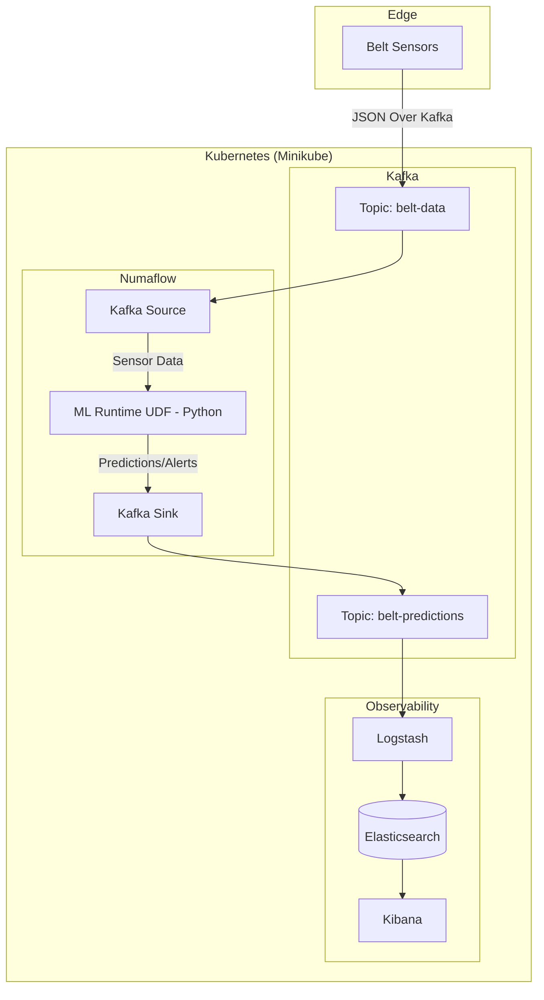

# Project Architecture

The Belt ML Runtime is a real-time Remaining Useful Life (RUL) prediction system for conveyor belts. It uses a stream-processing architecture to handle sensor data with low latency and high reliability.

## System Overview

The system follows a classic "Lambda-lite" architecture using Kafka as the message backbone and Numaflow as the processing engine.

## Component Breakdown

### 1. Kafka (Ingestion & Backbone)

Acts as the decoupled message broker.

- `belt-data`: Incoming raw sensor telemetry.
- `belt-predictions`: Outgoing RUL estimates and health scores.

### 2. Numaflow (Stream Processing)

A Kubernetes-native stream processing platform.

- **Source**: Consumes from Kafka.
- **ML Runtime (UDF)**: The core "brain" of the system.
- **Sink**: Produces results back to Kafka.

### 3. ML Runtime (Python)

A containerized Python application that:

- Implements stateful feature engineering.
- Runs scikit-learn based inference.
- Manages belt health states and alerts.
- Uses `pynumaflow` SDK for integration.

### 4. ELK Stack (Storage & Visualization)

- **Logstash**: Bridges Kafka predictions to Elasticsearch.
- **Elasticsearch**: Time-series storage for long-term analysis.
- **Kibana**: Dashboarding for real-time monitoring of belt health.

## Data Flow

1. Raw sensor data is pushed to Kafka.
2. Numaflow picks up the data and passes it to the ML UDF.
3. The UDF calculates rolling averages, applies the model, and determines RUL.
4. Results are pushed to a destination Kafka topic.
5. Logstash indexes the results into Elasticsearch for display in Kibana.
