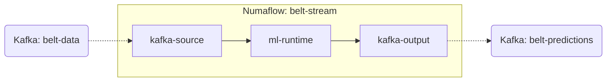

# Numaflow Pipeline Documentation

This document describes the stream processing pipeline configured for the Belt ML Runtime.

## Pipeline Specification

The pipeline is defined in `deploy/belt-pipeline.yaml` (and mirrored in the root as `belt-stream-pipeline.yaml`). It consists of three primary vertices linked by high-performance inter-step buffers.

### Visual Topology



## Vertices

### 1. `kafka-source`

- **Type**: Source
- **Implementation**: Kafka Consumer
- **Broker**: `kafka.kafka.svc.cluster.local:9092`
- **Topic**: `belt-data`
- **Consumer Group**: `belt-ml-group`
- **Responsibility**: Ingests raw telemetry from the conveyor belt sensors (JSON format).

### 2. `ml-runtime`

- **Type**: UDF (User Defined Function)
- **Implementation**: Python (`pynumaflow` SDK)
- **Image**: `belt-ml-runtime:latest`
- **Responsibility**:
  - Deserializes sensor data.
  - Performs stateful feature engineering (rolling windows, delta calculations).
  - Executes scikit-learn model inference.
  - Predicts Remaining Useful Life (RUL).
  - Generates health alerts based on pre-defined thresholds.

### 3. `kafka-output`

- **Type**: Sink
- **Implementation**: Kafka Producer
- **Broker**: `kafka.kafka.svc.cluster.local:9092`
- **Topic**: `belt-predictions`
- **Responsibility**: Publishes processed predictions and alerts back to the Kafka bus for downstream consumption by Logstash/Elasticsearch.

## Scaling Configuration

Currently, the pipeline is configured for a single-node setup (Minikube compatibility):

- **Min Replicas**: 1
- **Max Replicas**: 1

In production, these values should be adjusted based on the input partition count of the Kafka topics.

## Troubleshooting the Pipeline

To view the status of the pipeline:

```bash
kubectl get pipeline belt-stream
```

To see vertex pods:

```bash
kubectl get pods -l numaflow.numaproj.io/pipeline-name=belt-stream
```

To view logs for the ML Runtime:

```bash
kubectl logs -l numaflow.numaproj.io/vertex-name=ml-runtime -c main -f
```
