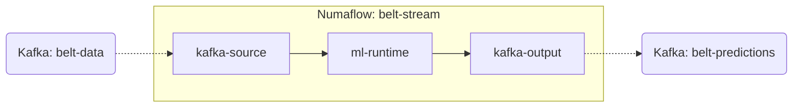

# Numaflow Pipeline Documentation

This document describes the stream processing pipeline configured for the Belt ML Runtime.

## Pipeline Specification

The pipeline is defined in `deploy/belt-pipeline.yaml` (and mirrored in the root as `belt-stream-pipeline.yaml`). It consists of three primary vertices linked by high-performance inter-step buffers.

### Visual Topology



## Vertices

### 1. `kafka-source`

- **Type**: Source
- **Implementation**: Kafka Consumer
- **Broker**: `kafka.kafka.svc.cluster.local:9092`
- **Topic**: `belt-data`
- **Consumer Group**: `belt-ml-group`
- **Responsibility**: Ingests raw telemetry from the conveyor belt sensors (JSON format).

### 2. `ml-runtime`

- **Type**: UDF (User Defined Function)
- **Implementation**: Python (`pynumaflow` SDK)
- **Image**: `belt-ml-runtime:latest`
- **Responsibility**:
  - Deserializes sensor data.
  - Performs stateful feature engineering (rolling windows, delta calculations).
  - Executes scikit-learn model inference.
  - Predicts Remaining Useful Life (RUL).
  - Generates health alerts based on pre-defined thresholds.

### 3. `kafka-output`

- **Type**: Sink
- **Implementation**: Kafka Producer
- **Broker**: `kafka.kafka.svc.cluster.local:9092`
- **Topic**: `belt-predictions`
- **Responsibility**: Publishes processed predictions and alerts back to the Kafka bus for downstream consumption by Logstash/Elasticsearch.

## Scaling Configuration

| Setting | Local (Minikube) | Production |
| ------- | ---------------- | ---------- |
| `kafka-source` min/max | 1 / 10 | 1 / (= Kafka partition count) |
| `ml-runtime` min/max | 2 / 10 | 2 / (= Kafka partition count) |
| `ml-runtime` CPU request/limit | 500m / 2 | Tune to p99 latency target |
| `ml-runtime` Memory request/limit | 1Gi / 4Gi | ≥ 2× RF model size |

> **Rule of thumb**: set `max` replicas equal to the number of partitions on the `belt-data` Kafka topic.
> Numaflow auto-scales based on NATS JetStream ISB backpressure.

## Production Deployment Checklist

Before deploying to a production cluster:

1. **Image registry** — Push the image to ECR/GCR and update `image:` tags to a pinned semantic version (not `:latest`). Remove `imagePullPolicy: Never`.
2. **Apply the thresholds ConfigMap first**:

   ```bash
   kubectl apply -f deploy/thresholds-configmap.yaml
   ```

3. **Apply the pipeline**:

   ```bash
   kubectl apply -f deploy/belt-pipeline.yaml
   ```

## Updating Thresholds Without a Restart

`thresholds.json` is mounted from the `belt-thresholds` ConfigMap at `/config/thresholds.json`.
The `AlertEngine` hot-reloads this file within **60 seconds** of any change (configurable via `THRESHOLDS_RELOAD_INTERVAL` env var).

```bash
# Edit the ConfigMap in-place
kubectl edit configmap belt-thresholds

# OR apply from a modified YAML file
kubectl apply -f deploy/thresholds-configmap.yaml
```

No `kubectl rollout restart` is needed.

## Environment Variables

| Variable | Default | Purpose |
| -------- | ------- | ------- |
| `ELASTIC_URL` | `http://elasticsearch.elastic.svc.cluster.local:9200` | Elasticsearch endpoint for state store |
| `STATE_INDEX_NAME` | `belt-runtime-state` | ES index used for per-belt state |
| `THRESHOLDS_PATH` | `model/thresholds.json` | Override path (set to `/config/thresholds.json` via ConfigMap volume) |
| `THRESHOLDS_RELOAD_INTERVAL` | `60` | Seconds between mtime checks for hot-reload (0 = disabled) |

## Troubleshooting the Pipeline

To view the status of the pipeline:

```bash
kubectl get pipeline belt-stream
```

To see vertex pods:

```bash
kubectl get pods -l numaflow.numaproj.io/pipeline-name=belt-stream
```

To view logs for the ML Runtime:

```bash
kubectl logs -l numaflow.numaproj.io/vertex-name=ml-runtime -c main -f
```
